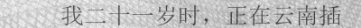
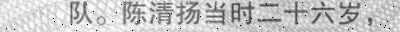
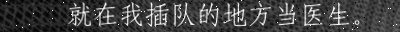
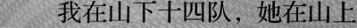

# SynthChinese
OCR语料合成：根据文本语料合成图像语料

## 1.结果示例

### 效果列表（非全部）
|效果名称|所在模块|备注|
|--------|-----|-------|
|oblique|font_util|倾斜|
|rotation|font_util|旋转|
|strong|font_util|加粗|
|wide|font_util|加宽|
|underline|font_util|下划线|
|box|cv_util|加外框|
|perspective|cv_util|透视变换|
|blur|cv_util|高斯模糊|
|filter|cv_util|emboss或sharp滤波|
|reverse|merge_util|反转颜色|
|noise|merge_util|噪点（4中类型）|

## 2.安装
git clone  https://github.com/Placeboooo/SynthChinese.git  
pip install requirements.txt
## 3.配置

见/configs/base.yaml  
  
  
其中:  
-TEXT：文本语料相关  
---SAMPLE: 控制样本规模、文本长度、字符集等  
---CORPUS：语料目录及语料类型、权重  
-BACKGROUND：背景相关，控制背景目录，及最终语料图片的size  
-EFFECT：效果控制  
---PYGAME：控制字体及其style，作用于【font_util】  
---OPENCV: 控制透视变换、外框、模糊、噪点等，作用于【cv_util】  
---MERGE: 控制文字图像与背景的融合，作用于【merge_util】

      
## 4.运行
python main.py  
结果：/samples/  
日志：/log/  

## 5.功能
### 1.语料工厂（corpus_factory）: 提供文本语料
### 2.font_util：根据字体文件将文本语料渲染成文字图像
### 3.cv_util：将文字图像进行透视变换、添加噪声...
### 4.merge_util：将文字图像与背景图像融合生成最终图像语料

